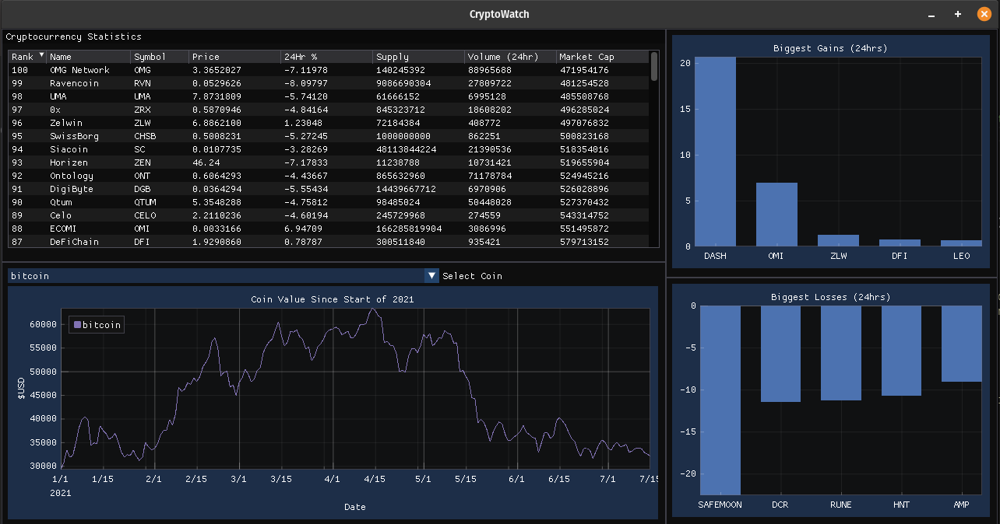

# Introduction

This project has been made for the Udacity C++ Capstone project. The application uses an OpenGL Gui to display Crypto currency data obtained from an online API.

# Build Instructions

1. git clone https://github.com/JPNZ4/CryptoWatch.git
2. cd CryptoWatch
3. git submodule init
4. git submodule update
5. mkdir build
6. cd build
7. cmake ..
8. make 

# Running Instructions

From the build directory run:
    ./CryptoWatch

# Description

The project uses GLFW and GLAD to create a window and an OpenGL context. The application then uses a library Imgui & ImPlot to display the latest cryptocurrency data obtained from the Coincap API.
The program has a loop continuosly running and polling the coincap API to update the data displayed in the widgets. There are 4 widgets on the page displaying the data. There is a Table which displays an overview of all the crypto currencies tracked on coincap. The table columns can be sorted by clicking on the header. 
There is a line plot below the table which displays one coins value since the start of 2021. You can use the select menu to change which coin is displayed.
There are two bar graphs on the right side of the application which display the top and bottom five crypto currencies in regards to the value change in percentage over the last 24 hours.
The widgets will scale in width with the application but no in height.

# Class Structure

There are three classes in addition to the main file

### CustomGLFWWindow
Handles the creation of the window and the OpenGL context that is used for the application.
### Data
The data class handles requesting data from the coincap API and formatting it for use.
### ImGuiLayer
Displays the different widgets using the data from the Data class.

# Expected Output

The program should display 4 widgets (table, plot, two bars graphs). The table data should automatically refresh and be sued to sort columns. The user can change which coin is viewed on the plot.

# Rubric Points Addressed
Ensure that the application you build will satisfy all criteria for the “README” and “Compiling and Testing” sections, and that the application will satisfy at least 5 total criteria from the rest of the rubric. Not all rubric items need to be satisfied in order to pass the project. 

### README (All Rubric Points REQUIRED)
- [x] A README with instructions is included with the project.
- [x] The README indicates which project is chosen.
- [x] The README includes information about each rubric point addressed.

### Compiling and Testing (All Rubric Points REQUIRED)
- [x] The submission must compile and run.

### Loops, Functions, I/O
- [x] The project demonstrates an understanding of C++ functions and control structures. (All files in /src)
- [ ] The project reads data from a file and process the data, or the program writes data to a file. (No file read, but JSON data obtained from API)
- [x] The project accepts user input and processes the input. (User can interact with widgets (sort table, change coin in plot) - imgui_layer.*)

### Object Oriented Programming
- [x] The project uses Object Oriented Programming techniques. (All files in /src)
- [x] Classes use appropriate access specifiers for class members. (imgui_layer / data / custom_glfw_window classes)
- [x] Class constructors utilize member initialization lists. (custom_glfw_window.h - line 5)
- [x] Classes abstract implementation details from their interfaces. (imgui_layer / data / custom_glfw_window classes)
- [x] Classes encapsulate behavior. (imgui_layer / data / custom_glfw_window classes)
- [ ] Classes follow an appropriate inheritance hierarchy. (No inheritance used)
- [ ] Overloaded functions allow the same function to operate on different parameters.
- [ ] Derived class functions override virtual base class functions.
- [ ] Templates generalize functions in the project.

### Memory Management
- [x] The project makes use of references in function declarations. (imgui_layer.h line 39)
- [ ] The project uses destructors appropriately.
- [ ] The project uses scope / Resource Acquisition Is Initialization (RAII) where appropriate.
- [ ] The project follows the Rule of 5.
- [ ] The project uses move semantics to move data, instead of copying it, where possible.
- [ ] The project uses smart pointers instead of raw pointers.

### Concurrency
- [x] The project uses multithreading. (data.cpp - line 20)
- [ ] A promise and future is used in the project.
- [x] A mutex or lock is used in the project. (data.cpp - line 148 & 91)
- [ ] A condition variable is used in the project.

